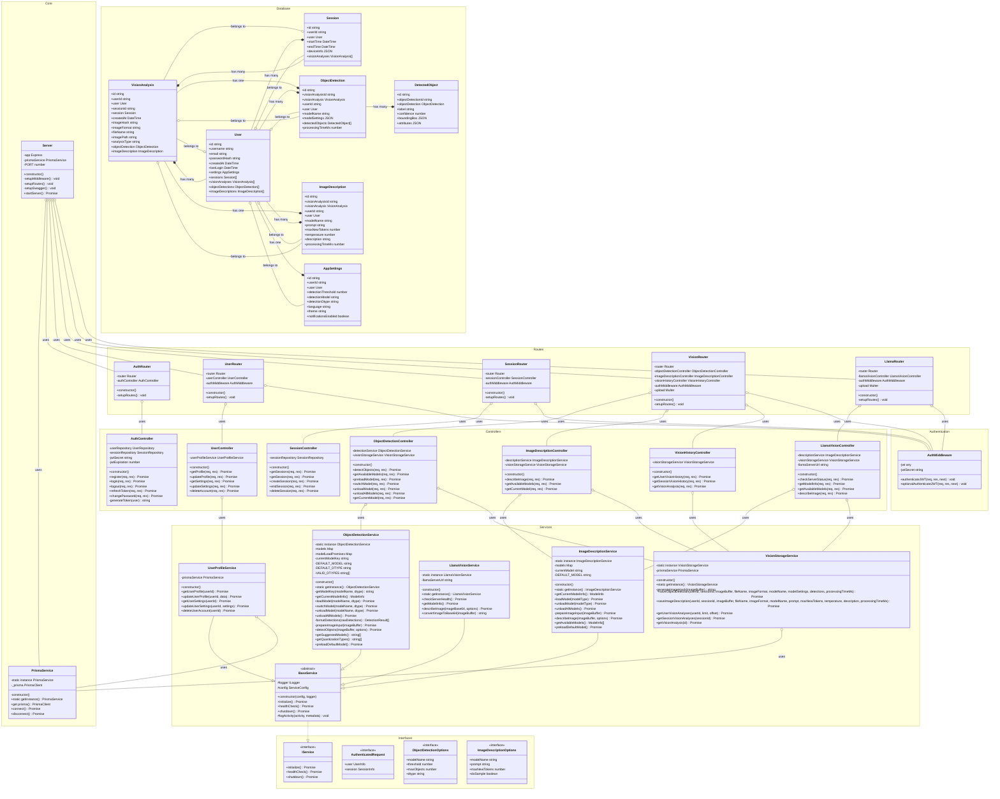

```mermaid
classDiagram
    %% Define namespaces for clarity
    namespace Core {
        class Server
        class PrismaService
    }

    namespace Services {
        class BaseService
        class ObjectDetectionService
        class ImageDescriptionService
        class LlamaVisionService
        class VisionStorageService
        class UserProfileService
    }

    namespace Database {
        class VisionAnalysis
        class ObjectDetection
        class DetectedObject
        class ImageDescription
        class User
        class Session
        class AppSettings
    }

    namespace Authentication {
        class AuthMiddleware
    }

    namespace Controllers {
        class ObjectDetectionController
        class ImageDescriptionController
        class LlamaVisionController
        class VisionHistoryController
        class AuthController
        class UserController
        class SessionController
    }

    namespace Routes {
        class AuthRouter
        class UserRouter
        class SessionRouter
        class VisionRouter
        class LlamaRouter
    }

    namespace Interfaces {
        class IService
        class AuthenticatedRequest
        class ObjectDetectionOptions
        class ImageDescriptionOptions
    }

    %% Define interfaces
    class IService {
        <<interface>>
        +initialize() Promise
        +healthCheck() Promise
        +shutdown() Promise
    }

    class AuthenticatedRequest {
        <<interface>>
        +user UserInfo
        +session SessionInfo
    }

    class ObjectDetectionOptions {
        <<interface>>
        +modelName string
        +threshold number
        +maxObjects number
        +dtype string
    }

    class ImageDescriptionOptions {
        <<interface>>
        +modelName string
        +prompt string
        +maxNewTokens number
        +doSample boolean
    }

    %% Define core classes
    class Server {
        -app Express
        -prismaService PrismaService
        -PORT number
        +constructor()
        -setupMiddleware() void
        -setupRoutes() void
        -setupSwagger() void
        +startServer() Promise
    }

    class PrismaService {
        -static instance PrismaService
        -_prisma PrismaClient
        -constructor()
        +static getInstance() PrismaService
        +get prisma() PrismaClient
        +connect() Promise
        +disconnect() Promise
    }

    %% Define abstract class
    class BaseService {
        <<abstract>>
        #logger ILogger
        #config ServiceConfig
        +constructor(config, logger)
        +initialize() Promise
        +healthCheck() Promise
        +shutdown() Promise
        #logActivity(activity, metadata) void
    }

    %% Define service classes
    class ObjectDetectionService {
        -static instance ObjectDetectionService
        -models Map
        -modelLoadPromises Map
        -currentModelKey string
        -DEFAULT_MODEL string
        -DEFAULT_DTYPE string
        -VALID_DTYPES string[]
        -constructor()
        +static getInstance() ObjectDetectionService
        -getModelKey(modelName, dtype) string
        +getCurrentModelInfo() ModelInfo
        +loadModel(modelName, dtype) Promise
        +switchModel(modelName, dtype) Promise
        +unloadModel(modelName, dtype) Promise
        +unloadAllModels() Promise
        -formatDetections(rawDetections) DetectionResult[]
        -prepareImageInput(imageBuffer) Promise
        +detectObjects(imageBuffer, options) Promise
        +getSuggestedModels() string[]
        +getQuantizationTypes() string[]
        +preloadDefaultModel() Promise
    }

    class ImageDescriptionService {
        -static instance ImageDescriptionService
        -models Map
        -currentModel string
        -DEFAULT_MODEL string
        -constructor()
        +static getInstance() ImageDescriptionService
        +getCurrentModelInfo() ModelInfo
        +loadModel(modelType) Promise
        +unloadModel(modelType) Promise
        +unloadAllModels() Promise
        -prepareImageInput(imageBuffer) Promise
        +describeImage(imageBuffer, options) Promise
        +getAvailableModels() ModelInfo[]
        +preloadDefaultModel() Promise
    }

    class LlamaVisionService {
        -static instance LlamaVisionService
        -llamaServerUrl string
        -constructor()
        +static getInstance() LlamaVisionService
        +checkServerHealth() Promise
        +getModelInfo() Promise
        +describeImage(imageBase64, options) Promise
        +convertImageToBase64(imageBuffer) string
    }

    class VisionStorageService {
        -static instance VisionStorageService
        -prismaService PrismaService
        -constructor()
        +static getInstance() VisionStorageService
        -generateImageHash(imageBuffer) string
        +saveObjectDetection(userId, sessionId, imageBuffer, fileName, imageFormat, modelName, modelSettings, detections, processingTimeMs) Promise
        +saveImageDescription(userId, sessionId, imageBuffer, fileName, imageFormat, modelName, prompt, maxNewTokens, temperature, description, processingTimeMs) Promise
        +getUserVisionAnalyses(userId, limit, offset) Promise
        +getSessionVisionAnalyses(sessionId) Promise
        +getVisionAnalysis(id) Promise
    }

    class UserProfileService {
        -prismaService PrismaService
        +constructor()
        +getUserProfile(userId) Promise
        +updateUserProfile(userId, data) Promise
        +getUserSettings(userId) Promise
        +updateUserSettings(userId, settings) Promise
        +deleteUserAccount(userId) Promise
    }

    %% Define controller classes
    class ObjectDetectionController {
        -detectionService ObjectDetectionService
        -visionStorageService VisionStorageService
        +constructor()
        +detectObjects(req, res) Promise
        +getAvailableModels(req, res) Promise
        +preloadModel(req, res) Promise
        +switchModel(req, res) Promise
        +unloadModel(req, res) Promise
        +unloadAllModels(req, res) Promise
        +getCurrentModel(req, res) Promise
    }

    class ImageDescriptionController {
        -descriptionService ImageDescriptionService
        -visionStorageService VisionStorageService
        +constructor()
        +describeImage(req, res) Promise
        +getAvailableModels(req, res) Promise
        +getCurrentModel(req, res) Promise
    }

    class LlamaVisionController {
        -descriptionService ImageDescriptionService
        -visionStorageService VisionStorageService
        -llamaServerUrl string
        +constructor()
        +checkServerStatus(req, res) Promise
        +getModelInfo(req, res) Promise
        +getAvailableModels(req, res) Promise
        +describeImage(req, res) Promise
    }

    class VisionHistoryController {
        -visionStorageService VisionStorageService
        +constructor()
        +getUserVisionHistory(req, res) Promise
        +getSessionVisionHistory(req, res) Promise
        +getVisionAnalysis(req, res) Promise
    }

    class AuthController {
        -userRepository UserRepository
        -sessionRepository SessionRepository
        -jwtSecret string
        -jwtExpiration number
        +constructor()
        +register(req, res) Promise
        +login(req, res) Promise
        +logout(req, res) Promise
        +refreshToken(req, res) Promise
        +changePassword(req, res) Promise
        -generateToken(user) string
    }

    class UserController {
        -userProfileService UserProfileService
        +constructor()
        +getProfile(req, res) Promise
        +updateProfile(req, res) Promise
        +getSettings(req, res) Promise
        +updateSettings(req, res) Promise
        +deleteAccount(req, res) Promise
    }

    class SessionController {
        -sessionRepository SessionRepository
        +constructor()
        +getSessions(req, res) Promise
        +getSession(req, res) Promise
        +createSession(req, res) Promise
        +endSession(req, res) Promise
        +deleteSession(req, res) Promise
    }

    %% Define middleware
    class AuthMiddleware {
        -jwt any
        -jwtSecret string
        +authenticateJWT(req, res, next) void
        +optionalAuthenticateJWT(req, res, next) void
    }

    %% Define route classes
    class AuthRouter {
        -router Router
        -authController AuthController
        +constructor()
        -setupRoutes() void
    }

    class UserRouter {
        -router Router
        -userController UserController
        -authMiddleware AuthMiddleware
        +constructor()
        -setupRoutes() void
    }

    class SessionRouter {
        -router Router
        -sessionController SessionController
        -authMiddleware AuthMiddleware
        +constructor()
        -setupRoutes() void
    }

    class VisionRouter {
        -router Router
        -objectDetectionController ObjectDetectionController
        -imageDescriptionController ImageDescriptionController
        -visionHistoryController VisionHistoryController
        -authMiddleware AuthMiddleware
        -upload Multer
        +constructor()
        -setupRoutes() void
    }

    class LlamaRouter {
        -router Router
        -llamaVisionController LlamaVisionController
        -authMiddleware AuthMiddleware
        -upload Multer
        +constructor()
        -setupRoutes() void
    }

    %% Define database models
    class VisionAnalysis {
        +id string
        +userId string
        +user User
        +sessionId string
        +session Session
        +createdAt DateTime
        +imageHash string
        +imageFormat string
        +fileName string
        +imagePath string
        +analysisType string
        +objectDetection ObjectDetection
        +imageDescription ImageDescription
    }

    class ObjectDetection {
        +id string
        +visionAnalysisId string
        +visionAnalysis VisionAnalysis
        +userId string
        +user User
        +modelName string
        +modelSettings JSON
        +detectedObjects DetectedObject[]
        +processingTimeMs number
    }

    class DetectedObject {
        +id string
        +objectDetectionId string
        +objectDetection ObjectDetection
        +label string
        +confidence number
        +boundingBox JSON
        +attributes JSON
    }

    class ImageDescription {
        +id string
        +visionAnalysisId string
        +visionAnalysis VisionAnalysis
        +userId string
        +user User
        +modelName string
        +prompt string
        +maxNewTokens number
        +temperature number
        +description string
        +processingTimeMs number
    }

    class User {
        +id string
        +username string
        +email string
        +passwordHash string
        +createdAt DateTime
        +lastLogin DateTime
        +settings AppSettings
        +sessions Session[]
        +visionAnalyses VisionAnalysis[]
        +objectDetections ObjectDetection[]
        +imageDescriptions ImageDescription[]
    }

    class Session {
        +id string
        +userId string
        +user User
        +startTime DateTime
        +endTime DateTime
        +deviceInfo JSON
        +visionAnalyses VisionAnalysis[]
    }

    class AppSettings {
        +id string
        +userId string
        +user User
        +detectionThreshold number
        +detectionModel string
        +detectionDtype string
        +language string
        +theme string
        +notificationsEnabled boolean
    }

    %% Class implementations and inheritance
    BaseService ..|> IService

    %% Service inheritance
    ObjectDetectionService --|> BaseService
    ImageDescriptionService --|> BaseService
    LlamaVisionService --|> BaseService
    UserProfileService --|> BaseService

    %% Service relationships
    LlamaVisionController o-- ImageDescriptionService : uses
    LlamaVisionController o-- VisionStorageService : uses
    ObjectDetectionController o-- ObjectDetectionService : uses
    ObjectDetectionController o-- VisionStorageService : uses
    ImageDescriptionController o-- ImageDescriptionService : uses
    ImageDescriptionController o-- VisionStorageService : uses
    VisionHistoryController o-- VisionStorageService : uses
    UserController o-- UserProfileService : uses

    %% Route relationships
    AuthRouter o-- AuthController : uses
    UserRouter o-- UserController : uses
    UserRouter o-- AuthMiddleware : uses
    SessionRouter o-- SessionController : uses
    SessionRouter o-- AuthMiddleware : uses
    VisionRouter o-- ObjectDetectionController : uses
    VisionRouter o-- ImageDescriptionController : uses
    VisionRouter o-- VisionHistoryController : uses
    VisionRouter o-- AuthMiddleware : uses
    LlamaRouter o-- LlamaVisionController : uses
    LlamaRouter o-- AuthMiddleware : uses

    %% Core relationships
    Server o-- PrismaService : uses
    Server o-- AuthRouter : uses
    Server o-- UserRouter : uses
    Server o-- SessionRouter : uses
    Server o-- VisionRouter : uses
    Server o-- LlamaRouter : uses

    %% Service-database relationships
    VisionStorageService o-- PrismaService : uses
    UserProfileService o-- PrismaService : uses

    %% Database relationships
    VisionAnalysis --o User : belongs to
    VisionAnalysis --o Session : belongs to
    VisionAnalysis --* ObjectDetection : has one
    VisionAnalysis --* ImageDescription : has one
    ObjectDetection --o User : belongs to
    ObjectDetection --o VisionAnalysis : belongs to
    ObjectDetection --* DetectedObject : has many
    ImageDescription --o User : belongs to
    ImageDescription --o VisionAnalysis : belongs to
    User --* AppSettings : has one
    User --* Session : has many
    User --* VisionAnalysis : has many
    User --* ObjectDetection : has many
    User --* ImageDescription : has many
    Session --o User : belongs to
    Session --* VisionAnalysis : has many
    AppSettings --o User : belongs to
``` 